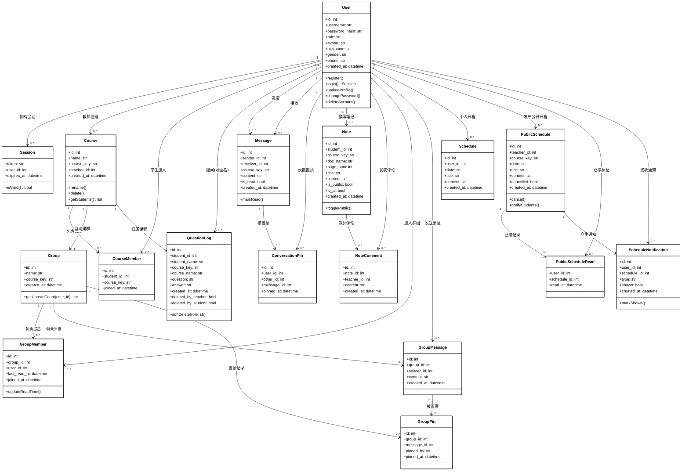

```mermaid
%%{init: {'theme': 'base', 'themeVariables': {
  'primaryColor': '#ffffff',
  'primaryTextColor': '#000000',
  'primaryBorderColor': '#000000',
  'lineColor': '#000000',
  'background': '#ffffff',
  'mainBkg': '#ffffff',
  'nodeBorder': '#000000',
  'clusterBkg': '#ffffff',
  'titleColor': '#000000',
  'edgeLabelBackground': '#ffffff'
}}}%%
classDiagram
  direction TB

  class User {
    +id: int
    +username: str
    +password_hash: str
    +role: str
    +avatar: str
    +nickname: str
    +gender: str
    +phone: str
    +created_at: datetime
    +register()
    +login() Session
    +updateProfile()
    +changePassword()
    +deleteAccount()
  }

  class Session {
    +token: str
    +user_id: int
    +expires_at: datetime
    +isValid() bool
  }

  class Course {
    +id: int
    +name: str
    +course_key: str
    +teacher_id: int
    +created_at: datetime
    +rename()
    +delete()
    +getStudents() list
  }

  class CourseMember {
    +id: int
    +student_id: int
    +course_key: str
    +joined_at: datetime
  }

  class QuestionLog {
    +id: int
    +student_id: int
    +student_name: str
    +course_key: str
    +course_name: str
    +question: str
    +answer: str
    +created_at: datetime
    +deleted_by_teacher: bool
    +deleted_by_student: bool
    +softDelete(role: str)
  }

  class Message {
    +id: int
    +sender_id: int
    +receiver_id: int
    +course_key: str
    +content: str
    +is_read: bool
    +created_at: datetime
    +markRead()
  }

  class ConversationPin {
    +id: int
    +user_id: int
    +other_id: int
    +message_id: int
    +pinned_at: datetime
  }

  class Note {
    +id: int
    +student_id: int
    +course_key: str
    +doc_name: str
    +page_num: int
    +title: str
    +content: str
    +is_public: bool
    +is_ai: bool
    +created_at: datetime
    +togglePublic()
  }

  class NoteComment {
    +id: int
    +note_id: int
    +teacher_id: int
    +content: str
    +created_at: datetime
  }

  class Group {
    +id: int
    +name: str
    +course_key: str
    +created_at: datetime
    +getUnreadCount(user_id) int
  }

  class GroupMember {
    +id: int
    +group_id: int
    +user_id: int
    +last_read_at: datetime
    +joined_at: datetime
    +updateReadTime()
  }

  class GroupMessage {
    +id: int
    +group_id: int
    +sender_id: int
    +content: str
    +created_at: datetime
  }

  class GroupPin {
    +id: int
    +group_id: int
    +message_id: int
    +pinned_by: int
    +pinned_at: datetime
  }

  class Schedule {
    +id: int
    +user_id: int
    +date: str
    +title: str
    +content: str
    +created_at: datetime
  }

  class PublicSchedule {
    +id: int
    +teacher_id: int
    +course_key: str
    +date: str
    +title: str
    +content: str
    +cancelled: bool
    +created_at: datetime
    +cancel()
    +notifyStudents()
  }

  class PublicScheduleRead {
    +user_id: int
    +schedule_id: int
    +read_at: datetime
  }

  class ScheduleNotification {
    +id: int
    +user_id: int
    +schedule_id: int
    +type: str
    +shown: bool
    +created_at: datetime
    +markShown()
  }

  %% ── 认证 ──
  User "1" --> "0..*" Session : 拥有会话

  %% ── 课程 ──
  User "1" --> "0..*" Course : 教师创建
  User "1" --> "0..*" CourseMember : 学生加入
  Course "1" --> "0..*" CourseMember : 包含成员
  Course "1" --> "1" Group : 自动建群

  %% ── 问答 ──
  User "0..1" --> "0..*" QuestionLog : 提问(可匿名)
  Course "1" --> "0..*" QuestionLog : 归属课程

  %% ── 私信 ──
  User "1" --> "0..*" Message : 发送
  User "1" --> "0..*" Message : 接收
  Message "1" --> "0..*" ConversationPin : 被置顶
  User "1" --> "0..*" ConversationPin : 设置置顶

  %% ── 笔记 ──
  User "1" --> "0..*" Note : 撰写笔记
  Note "1" --> "0..*" NoteComment : 教师评论
  User "1" --> "0..*" NoteComment : 发表评论

  %% ── 群组 ──
  Group "1" --> "0..*" GroupMember : 包含成员
  User "1" --> "0..*" GroupMember : 加入群组
  Group "1" --> "0..*" GroupMessage : 包含消息
  User "1" --> "0..*" GroupMessage : 发送消息
  GroupMessage "1" --> "0..*" GroupPin : 被置顶
  Group "1" --> "0..*" GroupPin : 置顶记录

  %% ── 日程 ──
  User "1" --> "0..*" Schedule : 个人日程
  User "1" --> "0..*" PublicSchedule : 发布公开日程
  PublicSchedule "1" --> "0..*" PublicScheduleRead : 已读记录
  User "1" --> "0..*" PublicScheduleRead : 已读标记
  PublicSchedule "1" --> "0..*" ScheduleNotification : 产生通知
  User "1" --> "0..*" ScheduleNotification : 接收通知
```
