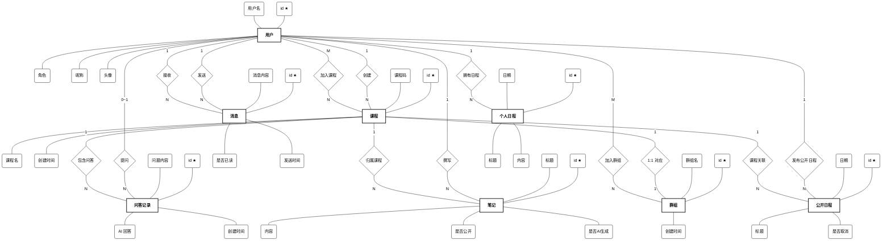

```mermaid
%%{init: {'theme': 'base', 'themeVariables': {
  'primaryColor': '#ffffff',
  'primaryTextColor': '#000000',
  'primaryBorderColor': '#000000',
  'lineColor': '#000000',
  'background': '#ffffff',
  'mainBkg': '#ffffff',
  'edgeLabelBackground': '#ffffff',
  'tertiaryColor': '#ffffff',
  'tertiaryTextColor': '#000000',
  'tertiaryBorderColor': '#000000'
}}}%%
graph TB

  %% ══════════════════════════════════════════════
  %% 实体（矩形）
  %% ══════════════════════════════════════════════
  E_User["用户"]
  E_Course["课程"]
  E_QLog["问答记录"]
  E_Note["笔记"]
  E_Msg["消息"]
  E_Group["群组"]
  E_Sched["个人日程"]
  E_PubSch["公开日程"]

  %% ══════════════════════════════════════════════
  %% 用户 属性（椭圆，★ 表示主键）
  %% ══════════════════════════════════════════════
  Au1("id ★")
  Au2("用户名")
  Au3("角色")
  Au4("昵称")
  Au5("头像")

  Au1 --- E_User
  Au2 --- E_User
  E_User --- Au3
  E_User --- Au4
  E_User --- Au5

  %% ══════════════════════════════════════════════
  %% 课程 属性
  %% ══════════════════════════════════════════════
  Ac1("id ★")
  Ac2("课程码")
  Ac3("课程名")
  Ac4("创建时间")

  Ac1 --- E_Course
  Ac2 --- E_Course
  E_Course --- Ac3
  E_Course --- Ac4

  %% ══════════════════════════════════════════════
  %% 问答记录 属性
  %% ══════════════════════════════════════════════
  Aq1("id ★")
  Aq2("问题内容")
  Aq3("AI 回答")
  Aq4("创建时间")

  Aq1 --- E_QLog
  Aq2 --- E_QLog
  E_QLog --- Aq3
  E_QLog --- Aq4

  %% ══════════════════════════════════════════════
  %% 笔记 属性
  %% ══════════════════════════════════════════════
  An1("id ★")
  An2("标题")
  An3("内容")
  An4("是否公开")
  An5("是否AI生成")

  An1 --- E_Note
  An2 --- E_Note
  E_Note --- An3
  E_Note --- An4
  E_Note --- An5

  %% ══════════════════════════════════════════════
  %% 消息 属性
  %% ══════════════════════════════════════════════
  Am1("id ★")
  Am2("消息内容")
  Am3("是否已读")
  Am4("发送时间")

  Am1 --- E_Msg
  Am2 --- E_Msg
  E_Msg --- Am3
  E_Msg --- Am4

  %% ══════════════════════════════════════════════
  %% 群组 属性
  %% ══════════════════════════════════════════════
  Ag1("id ★")
  Ag2("群组名")
  Ag3("创建时间")

  Ag1 --- E_Group
  Ag2 --- E_Group
  E_Group --- Ag3

  %% ══════════════════════════════════════════════
  %% 个人日程 属性
  %% ══════════════════════════════════════════════
  As1("id ★")
  As2("日期")
  As3("标题")
  As4("内容")

  As1 --- E_Sched
  As2 --- E_Sched
  E_Sched --- As3
  E_Sched --- As4

  %% ══════════════════════════════════════════════
  %% 公开日程 属性
  %% ══════════════════════════════════════════════
  Ap1("id ★")
  Ap2("日期")
  Ap3("标题")
  Ap4("是否取消")

  Ap1 --- E_PubSch
  Ap2 --- E_PubSch
  E_PubSch --- Ap3
  E_PubSch --- Ap4

  %% ══════════════════════════════════════════════
  %% 关系（菱形）及基数标注
  %% ══════════════════════════════════════════════
  R1{"创建"}
  R2{"加入课程"}
  R3{"提问"}
  R4{"包含问答"}
  R5{"撰写"}
  R6{"归属课程"}
  R7{"发送"}
  R8{"接收"}
  R9{"1:1 对应"}
  R10{"加入群组"}
  R11{"拥有日程"}
  R12{"发布公开日程"}
  R13{"课程关联"}

  E_User    -- "1"   --- R1  -- "N"   --- E_Course
  E_User    -- "M"   --- R2  -- "N"   --- E_Course
  E_User    -- "0~1" --- R3  -- "N"   --- E_QLog
  E_Course  -- "1"   --- R4  -- "N"   --- E_QLog
  E_User    -- "1"   --- R5  -- "N"   --- E_Note
  E_Course  -- "1"   --- R6  -- "N"   --- E_Note
  E_User    -- "1"   --- R7  -- "N"   --- E_Msg
  E_User    -- "1"   --- R8  -- "N"   --- E_Msg
  E_Course  -- "1"   --- R9  -- "1"   --- E_Group
  E_User    -- "M"   --- R10 -- "N"   --- E_Group
  E_User    -- "1"   --- R11 -- "N"   --- E_Sched
  E_User    -- "1"   --- R12 -- "N"   --- E_PubSch
  E_Course  -- "1"   --- R13 -- "N"   --- E_PubSch

  %% ══════════════════════════════════════════════
  %% 样式：全部白底、黑边、黑字（确保打印效果）
  %% ══════════════════════════════════════════════
  classDef entity fill:#ffffff,stroke:#000000,color:#000000,font-weight:bold,stroke-width:2px
  classDef attr   fill:#ffffff,stroke:#000000,color:#000000,stroke-width:1px
  classDef rel    fill:#ffffff,stroke:#000000,color:#000000,stroke-width:1px

  class E_User,E_Course,E_QLog,E_Note,E_Msg,E_Group,E_Sched,E_PubSch entity
  class Au1,Au2,Au3,Au4,Au5 attr
  class Ac1,Ac2,Ac3,Ac4 attr
  class Aq1,Aq2,Aq3,Aq4 attr
  class An1,An2,An3,An4,An5 attr
  class Am1,Am2,Am3,Am4 attr
  class Ag1,Ag2,Ag3 attr
  class As1,As2,As3,As4 attr
  class Ap1,Ap2,Ap3,Ap4 attr
  class R1,R2,R3,R4,R5,R6,R7,R8,R9,R10,R11,R12,R13 rel
```
